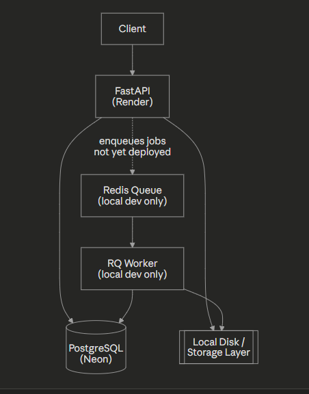
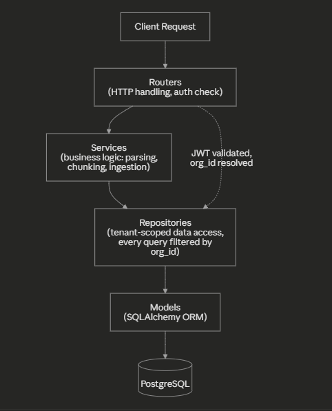

# Contract Intelligence & Clause-Risk Platform

A backend platform for ingesting contracts (PDF/DOCX), building a searchable per-tenant knowledge base, and answering natural-language questions about contract clauses via a RAG pipeline — with an agentic risk reviewer, citation verification, and prompt-injection defense layered on top.

**Live demo:** https://contract-intel-platform.onrender.com/docs

> ⚠️ **Free-tier hosting note:** the API is deployed on Render's free tier, which spins down after 15 minutes of inactivity. The first request after idle time can take 30–60 seconds to respond while the instance wakes up — this is expected, not a bug.
>
> ⚠️ **Current deployment scope:** only the web API is deployed. Document processing (parsing, chunking, embedding) requires a background worker (Redis + RQ), which is not yet deployed — uploads succeed and are stored, but `parse_status` will remain `pending` on the live demo until a worker is added. This is a deliberate, documented scope boundary for the current phase, not an oversight (see [Known Limitations](#known-limitations)).

---

## Problem

Legal and procurement teams manually review contracts for risky clauses — unlimited liability, silent auto-renewal, unfavorable termination terms — a slow, error-prone process where missing one clause in a 40-page contract has real consequences.

## Solution

Documents are parsed, chunked, and indexed on upload. A RAG pipeline answers natural-language questions grounded in retrieved chunks with exact source citations. An agentic reviewer (ReAct-style loop) works through a risk checklist autonomously, producing a structured, citation-backed report — replacing hours of manual first-pass review with a defensible draft a human still signs off on.

*(Everything below reflects the current state: a fully functional traditional backend. The AI layer is a separate, later phase and has not yet started.)*

---

## Architecture



**Ingestion flow (local dev):** Upload → save to disk → enqueue parse job (Redis/RQ) → worker parses (PyMuPDF/python-docx) → chunks (char-based, 1000/150 overlap) → stored in `chunks` table.

### Request Flow & Layering



`routers/` (HTTP, JWT validation, `org_id` resolution) → `services/` (business logic) → `repositories/` (tenant-scoped data access — every query filtered by `org_id`) → `models/` (SQLAlchemy ORM). See [decisions log](docs/project1-decisions-log.md) for why this structure was chosen over alternatives.

---

## Tech Stack

| Layer | Choice |
|---|---|
| API framework | FastAPI |
| Database | PostgreSQL 16 (Neon, hosted) |
| ORM / migrations | SQLAlchemy 2.0 + Alembic |
| Auth | JWT (access + refresh, bcrypt password hashing) |
| Async processing | Redis + RQ *(local dev only — not yet deployed)* |
| Document parsing | PyMuPDF (PDF), python-docx (DOCX) |
| Testing | pytest, 33 tests, 89% coverage |
| Containerization | Docker (multi-stage build) |
| Hosting | Render (API), Neon (database) |

---

## Key Engineering Decisions

Full reasoning, alternatives considered, and trade-offs for every decision below are in **[`docs/project1-decisions-log.md`](docs/project1-decisions-log.md)** — written specifically as interview-prep material, not just a changelog.

Highlights:
- **Tenant isolation** enforced at the repository layer — every query scoped by `org_id`, empirically verified with a cross-tenant access test (not just asserted).
- **Idempotent ingestion** — re-uploading the same document doesn't duplicate chunks; verified by reprocessing an already-completed document and confirming deterministic, byte-identical output.
- **Org-wide content-hash deduplication** — catches the realistic failure mode (same file uploaded twice under different names) rather than narrower per-document dedup.
- **Soft-delete only** for documents — no hard-delete endpoint exists; a legal-tech audit trail should never silently lose evidence of a contract review.
- **Access + refresh JWT tokens, no rotation** — a deliberate scope call, not a shortcut: full rotation with reuse detection is the right answer for production systems with real attackers, but a complexity I chose not to build (and couldn't fully defend) for this project's actual threat model.
- **Multi-stage Docker build** — build dependencies isolated from the final runtime image; a `.dockerignore` miss during setup caught a 228MB→9.33kB build-context bloat before it became a real problem.

---

## Running Locally

**Prerequisites:** Python 3.12+, Docker Desktop (with WSL2 on Windows), Git.

```bash
# Clone and set up
git clone https://github.com/nithinknkr/contract-intel-platform.git
cd contract-intel-platform
python -m venv venv
source venv/bin/activate  # or venv\Scripts\activate on Windows
pip install -r requirements.txt

# Start local Postgres + Redis (via docker-compose.yml)
docker compose up -d
# This starts two containers: contract-intel-postgres (port 5432) and contract-intel-redis (port 6379)

# Configure environment
cp .env.example .env
# edit .env with your local values

# Run migrations
alembic upgrade head

# Start the API
uvicorn app.main:app --reload --host 0.0.0.0 --port 8000
```

API docs available at `http://localhost:8000/docs`.

**Run tests:**
```bash
pytest --cov=app --cov-report=term-missing
```

---

## Known Limitations

These are documented, deliberate scope boundaries — not undiscovered bugs. Each is logged in detail in the [decisions log](docs/project1-decisions-log.md).

- **No background worker deployed.** Uploads succeed and are stored on the live demo, but processing (parsing/chunking) requires a worker that isn't deployed yet — `parse_status` stays `pending` on production. Fully functional in local dev (`docker compose` runs both Redis and a worker).
- **No OCR support.** Scanned/image-only PDFs fail cleanly with a documented reason rather than silently producing empty results.
- **No way to add a second user to an existing organization via the API** — signup always creates a new org. A known, named gap, not yet resolved (see decisions log).
- **CI/CD pipeline not yet set up.** Started, deliberately paused — tests are run and verified manually before each phase.

---

## Roadmap

- **Phase A** (traditional backend) — ✅ complete: ingestion, multi-tenant auth, search, testing, deployment
- **Phase B** — not yet started
- Background worker deployment
- CI/CD pipeline (GitHub Actions)
- Frontend (deferred until Phase A + B are both complete)

---

## Project Structure

```
app/
├── core/          # config, security, dependencies
├── db/            # session, base
├── models/        # SQLAlchemy models
├── repositories/  # tenant-scoped data access layer
├── routers/       # HTTP endpoints
├── schemas/       # Pydantic request/response models
└── services/      # business logic (parsing, chunking, ingestion, queue)
alembic/           # database migrations
tests/             # unit + integration tests
docs/              # decisions log
```